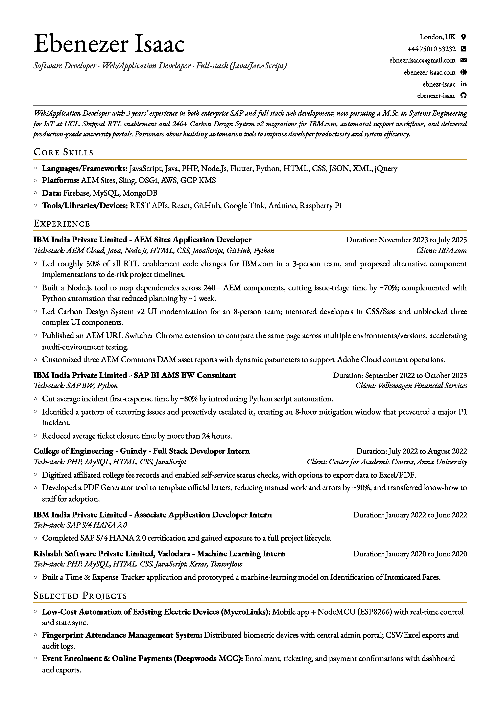

# jsonresume-theme-academic

> Academic serif theme for [JSON Resume](https://jsonresume.org) — EB Garamond, small-caps headings, gold accents. Print-first, PDF-ready.

[](https://www.npmjs.com/package/jsonresume-theme-academic)
[](LICENSE)



## Features

- Academic serif typography (EB Garamond)
- A4 print-first layout with precise margins
- Built-in HTML sanitization (XSS-safe)
- Customizable section headings via `meta.headings`
- Zero runtime dependencies
- ESM + CJS + UMD builds with TypeScript declarations

## Quick Start

### With resumed (recommended)

```bash
npm install jsonresume-theme-academic
npx resumed render resume.json --theme jsonresume-theme-academic
# → resume.html ready
```

### With resume-cli

```bash
npm install -g resume-cli jsonresume-theme-academic
resume export resume.pdf --theme academic
```

### Programmatic Usage

```typescript
import { render, pdfRenderOptions } from 'jsonresume-theme-academic';

const html = render(resumeJson);
// html is a self-contained HTML document

// For Puppeteer PDF rendering:
await page.pdf(pdfRenderOptions);
```

## Customization

### Section Headings

Override default headings via `meta.headings`:

```json
{
  "meta": {
    "headings": {
      "experience": "Professional Experience",
      "skills": "Technical Skills",
      "education": "Academic Background"
    }
  }
}
```

Available keys: `skills`, `experience`, `projects`, `education`, `volunteer`, `certifications`, `additional`

### PDF Rendering Options

The exported `pdfRenderOptions` provides optimized settings for Puppeteer/Gotenberg:

```typescript
{
  mediaType: 'print',
  format: 'A4',
  margin: { top: '12mm', right: '14mm', bottom: '12mm', left: '14mm' }
}
```

## Development

```bash
git clone https://github.com/ebenezer-isaac/jsonresume-theme-academic.git
cd jsonresume-theme-academic
npm install
npm run dev       # Start dev server
npm test          # Run tests
npm run build     # Build ESM + CJS + UMD
```

## Contributing

See [CONTRIBUTING.md](CONTRIBUTING.md)

## License

MIT
